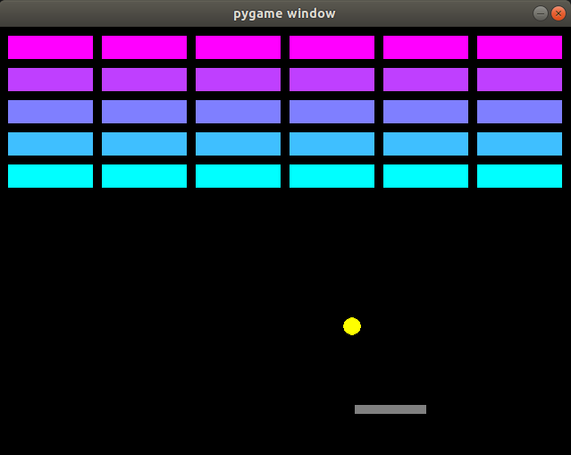

# Breakout
InteractiveVisualization-izumi-lilo created by GitHub Classroom  

Code for our version of the game 'Breakout' using pygame library by Izumi and Lilo.  
Run **breakout.py** to play!

- Can modify the game state in model.py to edit the wall dimensions and color scheme.
- mvc is the model, controller, view format, while non-mvc is the original version of the code.

 
