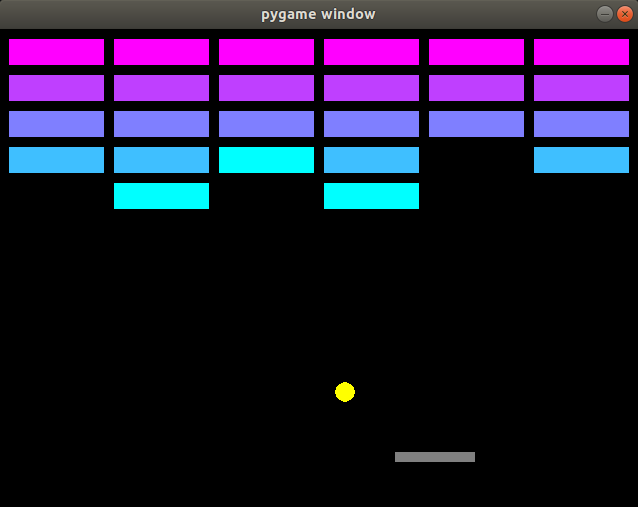
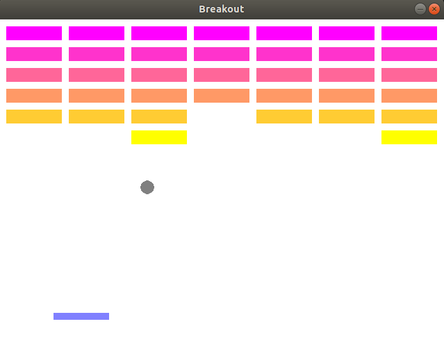

# Breakout
Code for our version of the arcade game 'Breakout' using pygame library by Izumi & Lilo.  

1. Run **pip install pygame** to install the pygame library
2. Run **python breakout.py** to play!
3. Can customize the game state in **model.py**, for example to edit the wall dimensions and color scheme

See **[reflection](reflection.md)** for more details.

 
